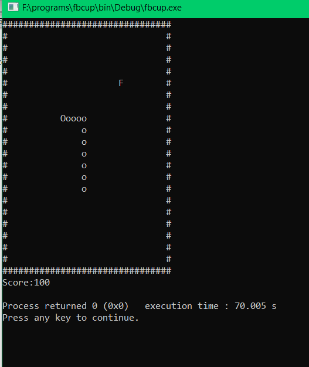

# snake_game
A classic snake game with standard snake ,food, and boundaries.
Features: 
1. Snake length and score increases as it eats food.
2. w, a, s, d to control snake.
3. Snake comes out from other side of wall if it is entered into walls.
4. Hitting snake’s own body will end up the game.
5. Score will be incremented when snake eats food. 
6. Press x to exit.

